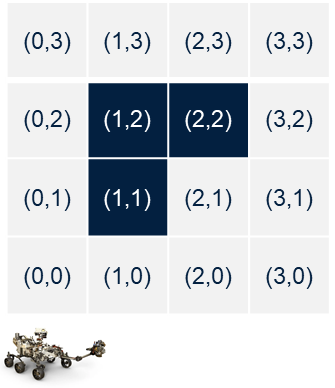

# Assignment: Introduction to Python II

* Write a python code that moves the robot to goal

    –The obstacles are at (1,1) , (1,2), (2,2)

    –The robot is at (0,0)

    –The robot should reach to (3,3)

    –The robot should avoid collision

    –Every iteration the robot checks all grids around it and move 1 grid cell each time

    –Robot is operating on a 2D grid with a cell size of 1x1

* On completion the assignment you have to submit:
    The screenshot of a plot of the path.
    Implementation code.

